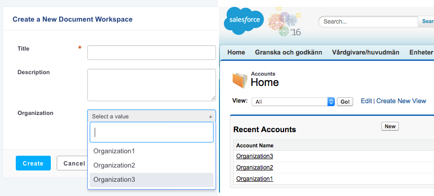

# nuxeo-salesforce-connector


Using the REST API of Salesforce based on Force.com, the idea is to display a list of items coming from Salesforce in a nuxeo dropdown list.
## Important Note

**These features are not part of the Nuxeo Production platform.**

These solutions are provided for inspiration and we encourage customers to use them as code samples and learning resources.

This is a moving project (no API maintenance, no deprecation process, etc.) If any of these solutions are found to be useful for the Nuxeo Platform in general, they will be integrated directly into platform, not maintained here.

## Requirements
Building requires the following software:
- git
- maven

## How to build 
```
git clone https://github.com/nuxeo-sandbox/nuxeo-salesforce-connector
cd nuxeo-salesforce-connector
mvn clean install
```

## Deploying
- Install the marketplace package by uploading the zip file that you will find here: nuxeo-directory-connector-mp/target/nuxeo-directory-connector-mp-8.3-SNAPSHOT.zip


## Using the plugin 
- To use the plugin you need to configure the OAuth provider under Admin > Cloud Services > Service Providers using a ClientID and a ClientSecret that you get from Salesforce.
- Then you need to authenticate once to get the access_token by going into Home > Cloud Services > Connect to Salesforce.  
You will find a step by step configuration in a coming blog.

## Known limitations
This plugin is a work in progress.

## About Nuxeo
Nuxeo dramatically improves how content-based applications are built, managed and deployed, making customers more agile, innovative and successful. Nuxeo provides a next generation, enterprise ready platform for building traditional and cutting-edge content oriented applications. Combining a powerful application development environment with SaaS-based tools and a modular architecture, the Nuxeo Platform and Products provide clear business value to some of the most recognizable brands including Verizon, Electronic Arts, Netflix, Sharp, FICO, the U.S. Navy, and Boeing. Nuxeo is headquartered in New York and Paris. More information is available at [www.nuxeo.com](http://www.nuxeo.com).
